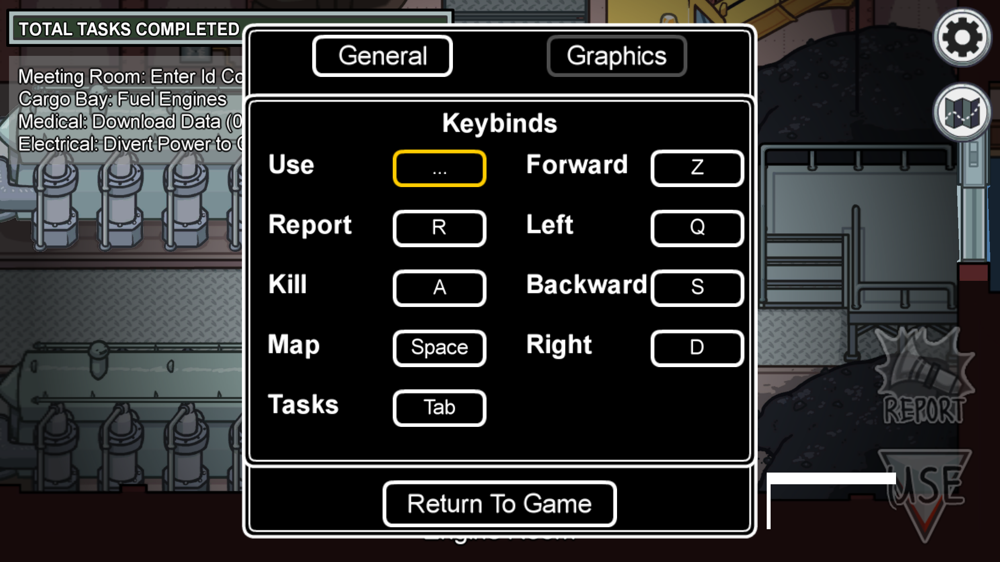
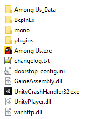

# CustomKeyBinds
Among us mod that allow you to set custom keybinds for common actions through an ingame menu. (The mod must be launched even after changing the keybinds)

*Click ^*

# Technical stuff
This mod is using BepInEx for patching the game at runtime, it **DOES NOT** modify any game files.

- Steam 2020.12.9s support ONLY (send me Itch obfuscated names if you want it)
- Code with unobfuscated names is available in 2020.9.9s branch

## Known issues
When selecting Escape keybind, the key will be set properly but it'll close the settings window.

## Installation
- Download the [lastest release](https://github.com/Herysia/CustomKeyBinds/releases/latest).
- Extract the files into Among us game files (`steam/steamapps/common/Among us`)
- This should look like this 

- **Run the game from steam**

### Installation side note
If you want to install BepInEx by yourself, please download latest **IL2CPP_x86** bleeding edge build from [here](https://builds.bepis.io/projects/bepinex_be) and then copy the plugin dll into `Among us/BepInEx/plugins`
Then add the files downloaded from [here](https://github.com/HerpDerpinstine/MelonLoader/blob/master/BaseLibs/UnityDependencies/2019.4.9.zip) to `BepInEx/unhollowed/base`

## Build
- Install and run the mod once (or BepInEx alone), on your game target version
- Edit `CustomKeyBinds.csproj` ReferencePath to match BepInEx folder (unhollowed & core)
- Build
- Copy the dll from the output directory to `Among us/BepInEx/plugins`

- /!\ If the version mismatch

# Licensing
CustomKeyBinds is licensed under the MIT License, Version 2.0. See [LICENSE](LICENSE.md) for the full License.

Third-party libraries:
- [BepInEx](https://github.com/BepInEx/BepInEx) is licensed under the LGPL 2.0 License. See [LICENSE](https://github.com/BepInEx/BepInEx/blob/master/LICENSE) for the full License.
- Unity Runtime libraries are part of Unity Software.  
Their usage is subject to [Unity Terms of Service](https://unity3d.com/legal/terms-of-service), including [Unity Software Additional Terms](https://unity3d.com/legal/terms-of-service/software).

### Discord: Herysia#4293